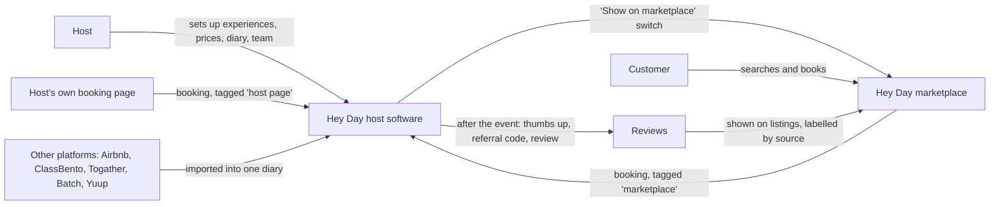

# Hey Day marketplace: what to build next

**For:** Claude Code, turning Jem’s marketplace homepage design into a working site that fits together with the Hey Day host software.
**From:** Jem, with Claude, 13 September 2026. Russell to review.
**Read with:**
- `HEYDAY-MARKETPLACE-WEBSITE-BRIEF.md`: the research, the customer and host journeys, the page plan and the policies to decide.
- `BUILD-NEXT-HEYDAY-SAAS.md`: the host software site.

---

## Where things stand

- **The design:** Jem’s homepage exists as a single HTML page, https://claude.ai/code/artifact/5384682b-c265-4ffd-9ee4-c3cb2ded4432. Section 2 of the marketplace brief describes it, section by section. It isn’t in a code repository yet.
- **The host software site** is jobbie (`tipsyparties-cyber/jobbie`). It’s a marketing site, built separately.
- **The product:** there isn’t one behind either site yet. No host accounts, no listings, no bookings. The Tipsy system has the machinery for one business (marketplace brief, section 11), and still has to be opened up to many.

So the next steps are, in order:
1. Turn the design into a real site that collects interest.
2. Build the page templates with clearly marked example data.
3. Agree one data shape with the host software, so the two plug together when the product exists.

---

## How the marketplace and the host software fit together

The host software is the *supply* side: hosts run their business on it. The marketplace is the *demand* side: customers find and book those hosts. Plenty of companies work this way, pairing software businesses pay for with a place customers browse (Fresha, Booksy and Mindbody, and Airbnb’s tools for its hosts). Hey Day’s version is for experiences and event services.



**The rules that tie them together:**

1. **One host account.** “Become a host” on the marketplace and “Start free trial” on the software site lead to the same sign-up.
2. **Listings are made in the software,** not on the marketplace. Each experience has a “Show on the Hey Day marketplace” switch.
3. **One booking engine.** The marketplace, the host’s own booking page and any booking widget all use the same prices, rules and diary.
   - That’s how the marketplace can show real prices and live availability, even for at-yours bookings priced by group size and distance.
   - Other sites say “pricing upon request” for those.
4. **Every booking records where it came from:** marketplace, the host’s own page, imported from another platform, or a repeat client. That tag decides the fee and who can market to the customer. Both are policies to decide (marketplace brief, section 12).
5. **Messages go through the host’s one inbox.** Phone numbers stay hidden until the policy says otherwise.
6. **Reviews** are collected by the software after every booking and shown on the marketplace, labelled by where the booking came from.
7. **Gift vouchers:**
   - Hey Day vouchers can be spent with any host.
   - A host’s own vouchers are spent with that host.
8. **Cross-promotion only with consent:** “You loved the pottery. Try printmaking next.”
9. **Every event is a shop window.** A QR code at an at-yours event (on the menu, the tip jar or the photo gallery) leads guests to the host’s marketplace page.
10. **The same words on both sides:**
    - host and experience
    - At yours / At theirs / Online
    - Tickets / Private / Gifts

---

## Phase 0: decisions (Jem and Russell)

| Decision | Options | Suggestion |
|---|---|---|
| **Domain structure** | One domain with two doors (customers at the main address, hosts at a “/hosts” or “for business” address), or two separate sites | One domain, two doors, as Airbnb does with its host pages and Fresha with its “for business” site. Brand, search ranking and trust all build up in one place. |
| **Code** | A new repo for the marketplace, or add it to jobbie | A new repo (for example `heyday-marketplace`). Both sites keep moving on their own, and one domain can still serve both later (on Vercel, by routing the hosts’ address to the software site). |
| **One look for both** | Jem’s marketplace look, or the HoneyBook colours jobbie uses now | Decide together with the software site’s Phase 0. The two should clearly be one brand. |
| **Voice and market** | The design reads British (pounds, “hen dos”, “have a nose around”); the software is US first | The launch city decides the words. Pick the city first. |
| **Launch order** | Software first, or both together | Hosts before customers: the software first, with a customer waiting list open now. The marketplace brief (section 13) suggests the same. |
| **Fees and who owns the customer** | See the marketplace brief, sections 10 and 12 | Decide before any fee is shown on the site. |

---

## Phase 1: turn the design into a site that collects interest

- **Start a new Next.js app,** on the same Next.js version as jobbie. Read the note in jobbie’s `AGENTS.md`: this Next.js version differs from older ones.
- **Rebuild the design as components.**
  - Read the design with the Artifact tool’s read action, using the URL above.
  - Keep Jem’s words exactly as written.
  - Keep the section order from the marketplace brief, section 2.
- **Put the fonts and colours in one design-tokens file:**
  - Display fonts: Anton, Bowlby One, Big Shoulders Display.
  - Body fonts: Quicksand and Hanken Grotesk.
  - Colours: the eleven combinations from Jem's colour board (13 September), in `HEYDAY-SITES-DESIGN-BRIEF.md` Part C2. They replace the colours in the first design (#EDE6D8, #2E2A20, #1F5FDC, #C63A18, #EF4E2A and #F4E08C).
- **Keep the honest placeholders.**
  - Reviews stay as “Nothing here is a review yet”.
  - The host cards and experiences are labelled as examples.
  - Images stay as art-direction slots until real photography exists.
- **The two forms:**
  - “Join the Hey Day collective”, for customers.
  - “Become a host”, which leads to early access for the host software.
  - Don’t store or send anything until the privacy notice and marketing-consent wording are agreed. Never email anyone automatically.
- **Build the pages the homepage links to, starting with:**
  - How Hey Day works
  - Become a host
  - Gifts (an explainer for now)
  - About
  - FAQs
  - Contact
  - Terms and Privacy

**Done when:** every link on the homepage goes to a real page or is removed, and nothing pretends to be a real listing or a real review.

---

## Phase 2: page templates, with example data clearly marked

- **Write a seed file of example experiences and hosts,** using the data shape in Phase 3.
  - Mark every item `example: true`, and show it with an “Example listing” badge.
  - Base them on the homepage’s own examples, such as “Learn three, drink three.” and “Flour everywhere. Worth it.”
- **Build the templates from the page plan** (marketplace brief, section 8):
  - search results, with filters, map and list views, and sorting
  - the seven category pages, then activity pages and area pages
  - the experience page, following the full anatomy in section 8
  - the host profile
  - gifts, the Teams hub, and online experiences
- **No booking yet.** Buttons such as “Request” and “Notify me” add people to the waiting list, and say so.

---

## Phase 3: one data shape, shared with the host software

Agree this before either side builds the real product. The marketplace reads what hosts publish from the software, so both need the same shape. A starting sketch:

```ts
type Host = {
  id: string; name: string; story: string; photos: string[];
  area: string; categories: Category[]; responseTimeHours?: number;
  checks: { identity: boolean; insurance: boolean; foodHygiene?: boolean; alcoholLicense?: boolean; backgroundCheck?: boolean };
};

type Experience = {
  id: string; hostId: string; title: string; category: Category;
  place: "at-yours" | "at-theirs" | "online";
  formats: ("tickets" | "private" | "gift")[];
  durationMinutes: number; groupMin: number; groupMax: number;
  pricing: PriceRule; travelArea?: { centre: string; miles: number };
  includes: string[]; bring: string[]; ageMin?: number;
  accessibility: string; cancellation: string;
  showOnMarketplace: boolean; example?: boolean;
};

type PriceRule = {
  kind: "per-person" | "per-group" | "quote";
  base: number; perExtraGuest?: number; minimumSpend?: number;
  travelBands?: { upToMiles: number; charge: number }[];
  busyDates?: { date: string; uplift: number }[];
};

type Session = { id: string; experienceId: string; start: string; end: string; capacity: number; placesLeft: number };

type Booking = {
  id: string; experienceId: string; sessionId?: string;
  source: "marketplace" | "host-page" | "imported" | "repeat";
  guests: number; total: number; deposit: number; status: string;
};

type Review = { id: string; bookingId: string; rating: 1 | 2 | 3 | 4 | 5; text: string; source: Booking["source"] };

type Voucher = { code: string; kind: "hey-day" | "host" | "experience"; balance: number; expires?: string };
```

**What already exists at Tipsy for this** (marketplace brief, section 11):
- **`PriceRule`** matches the Tipsy quote engine (priced by guests, hours, travel and date).
- **The availability check** exists as Tipsy’s check before a booking is confirmed.
- **Hidden numbers, QR tips, next-day feedback and the complaint flow** are all built.
- **Tickets, vouchers, many hosts in one system, search, and payouts to many hosts** are still to build.

---

## Phase 4: when the host software exists

Build the real marketplace in this order, each step on top of the last:

1. **Real listings from real hosts,** with Tipsy Parties first: cocktail classes at theirs, and bar hire at yours.
2. **Live availability,** from the hosts’ diaries.
3. **Booking and payment,** paying out to many hosts through Stripe Connect.
4. **Messages,** through the host’s inbox.
5. **Reviews,** and the thumbs up, then referral code, then review flow.
6. **Gift vouchers,** and the Teams hub with company invoicing.
7. **Search and area pages** at scale.
8. **Cross-promotion,** with consent.

---

## Getting to launch (suggestions for Jem and Russell)

- **Give hosts one sign-up with two benefits:** “Run your business on Hey Day, and get found on Hey Day.” A free marketplace listing comes with the software.
- **Start with one city and a few categories** where there are plenty of hosts. Food & Drink and Make & Create suit Tipsy’s network.
- **Grow the Hey Day Collective email list** before launch, so there are customers on day one.
- **Open the Teams hub** ahead of the Christmas party season.

**Open questions:** `HEYDAY-MARKETPLACE-WEBSITE-BRIEF.md`, section 12.
